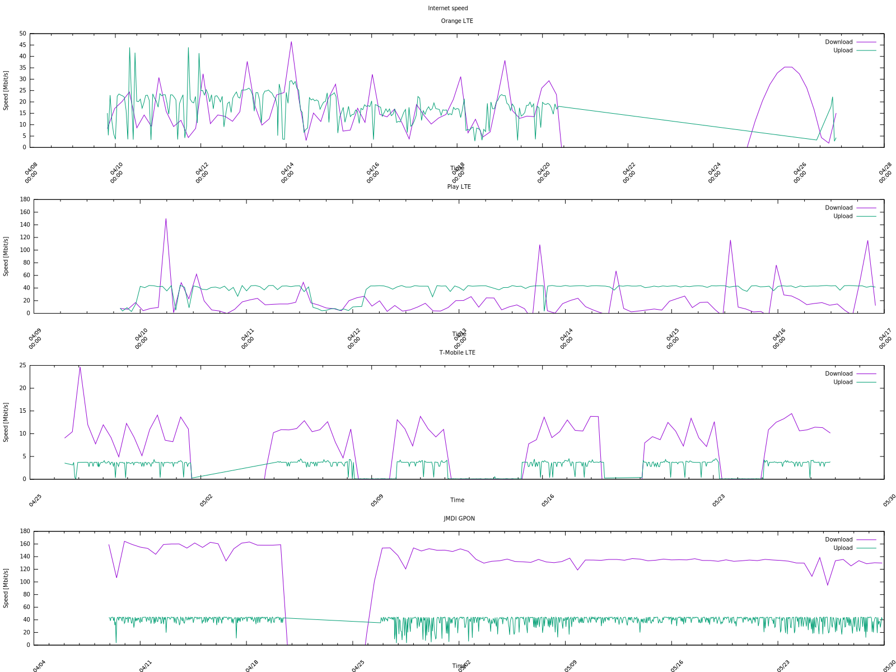

# Netspeed

The netspeed scripts can be used to periodically monitor and save connection performance for specified gateways which default routes are defined on a system. If those gateways lead to different ISPs then this data can be used to monitor performance of currently used ISPs or to aid in choosing a best ISP for our needs.

The script currently uses a simple check for connection performnce - speedtest-cli which simply measures RTT and upload/download to an arbitrarily chosen test server. This can be changed however in the script using either environment variables (`TEST_CMD` and `TEST_INITCMD`) inside a suitable systemd EnvironmentFile *or* by using commandline arguments -c and -C.

The script uses a netns based approach to run arbitrary commands in a network namespace created in such a way that it bridges with the interface leading to a particular gateway. This means that it can also be used for ad-hoc experiments by letting it setup the network namespace which can be later accessed using `ip netns exec` command.

The script requires a simple configuration file with the gateway identifiers, their IP addresses (used to find the interfaces
that lead to them) and a name which is used for descriptive purposes:

```
# cat /etc/network-speed.conf
jmdi 10.10.10.1 JMDI GPON
lte-orange 192.168.8.1 Orange LTE
lte-play 192.168.9.1 Play LTE
lte-tmobile 192.168.10.1 T-Mobile LTE
```

The above example shows 4 different gateways leading via some major Polish LTE cellular networks and a local ISP serving FTTH.

The script results are put in /var/lib/network-speed (by default) as CSV files which can be plotted using gnuplot or some other tool.

Example data is available in the example-data/ directory. A gnuplot script is provided to make a plot from the data:

```
➜  netspeed git:(master) ✗ gnuplot plot-speed.gnuplot 
```



## Setup

Setup is performed using ansible which installs all of the scripts, creates systemd files and so on. The example below deploys the netspeed scripts on a Raspbian 9.6 running on a Raspberry Pi 3:

```
$ ansible-playbook -i inventories/prod netspeed.yml

PLAY [all] *****************************************************************************************************************************************************************************************

TASK [Gathering Facts] *****************************************************************************************************************************************************************************
ok: [netspeed]

TASK [netspeed : Install dependencies] *************************************************************************************************************************************************************
ok: [netspeed] => (item=bridge-utils)

TASK [netspeed : Create scripts in /usr/local/bin] *************************************************************************************************************************************************
ok: [netspeed] => (item=network-speed.j2)

TASK [netspeed : Create systemd units in /etc/systemd/system] **************************************************************************************************************************************
ok: [netspeed] => (item=network-speed.service.j2)
ok: [netspeed] => (item=network-speed.timer.j2)

TASK [netspeed : Create tmpfiles.d definitions in /etc/tmpfiles.d] *********************************************************************************************************************************
ok: [netspeed] => (item=tmpfiles.d/network-speed.conf.j2)

TASK [netspeed : Enable and start the network-speed service] ***************************************************************************************************************************************
changed: [netspeed]

PLAY RECAP *****************************************************************************************************************************************************************************************
netspeed                   : ok=6    changed=1    unreachable=0    failed=0
```
